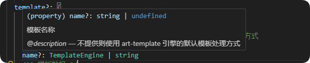
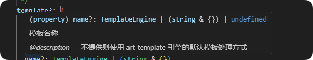
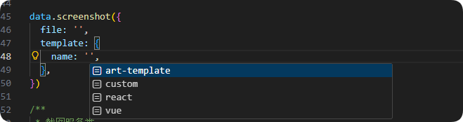

---

title: TS 中的奇技淫巧：用 string & {} 同时允许预设值与任意字符串
date: 2025-12-04
categories:
   - diary
tags:
   - TypeScript
   - 技巧
   - 编程
---

## 天气心情

天气：☁️ 多云
心情：😌 平静

## 今日份奇技淫巧分享

今天在写 **karin 2.0 渲染器核心** 时，遇到一个有趣的类型定义需求。

我需要一个字段：

* **能给出预设值提示（如 art-template、vue 等）**
* **但又不能限制用户输入，任意字符串也要允许**

最开始的写法是这样：

```ts
/**
 * 模板渲染器类型
 */
export type TemplateEngine = 'art-template' | 'vue' | 'react' | 'custom'

/**
 * 模板引擎配置
 */
export interface TemplateEngineOptions {
  name: TemplateEngine | string
  options?: Record<string, any>
}
```

但这样 `name: string` 会让联合类型“塌缩”，VSCode 直接只当成 `string`，提示也没了：


---

## 目标：既要提示，又要自定义

理想情况是：

* 输入预设值时，VSCode 能自动补全
* 但输入 `"my-own-engine"` 这种非预设值也不会报错

经过一番折腾，终于找到一个巧妙的 hack：

```ts
/**
 * 模板引擎配置
 */
export interface TemplateEngineOptions {
  name: TemplateEngine | (string & {})
  options?: Record<string, any>
}
```

效果拔群：



VSCode 会同时：

* 显示预设枚举值
* 又不禁止你输入任意字符串



这就是 `string & {}` 的魔法：

> 它让 TypeScript 不再把联合类型简化为 `string`，从而保留下字面量提示。

---

## 总结

`TemplateEngine | (string & {})` 是一种常见的 TypeScript 类型技巧，用于在保持精确字面量提示的同时，仍然允许输入任意字符串。

由于 `string` 在联合类型中会吸收字面量类型（widening simplification），直接写成 `TemplateEngine | string` 会导致 VSCode 不再展示预设值的补全提示。

通过将 `string` 与空对象 `{}` 做交叉得到 `(string & {})`，可以阻止这种简化，让字面量联合类型继续保持精确，从而同时拥有“预设值智能提示”与“自定义字符串输入”的双重能力。

这一技巧非常适用于框架配置、插件系统、驱动名称等场景，在 TypeScript 库设计中能显著提升类型安全和开发体验。

---

啦啦啦，今天的奇技淫巧分享到这里啦~
希望这个小技巧也能帮你写出更友好的类型定义 ✨
